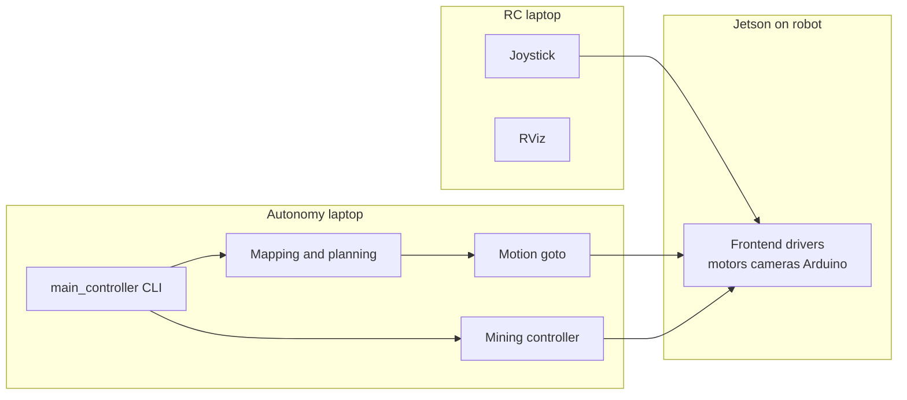

# Project audit — simple overview

Plain-language summary of how the robot software fits together, what is solid, and what to fix first.

**Task checklist:** [`docs/TODO_CHECKLIST.md`](TODO_CHECKLIST.md)  
**Bench / field sensor & actuator tests:** [`docs/FIELD_TEST_CHECKLIST.md`](FIELD_TEST_CHECKLIST.md)

For detail wiring (topics and nodes), see `docs/architecture.mmd`.

---

## Big picture — three computers

- **Jetson** talks to hardware (wheels, bucket, conveyor, servos, sensors).
- **RC laptop** drives manually and visualizes.
- **Autonomy laptop** runs maps, paths, “go here,” and autonomous mining commands.

---

## What each part does

| Piece | Job |
|-------|-----|
| **frontend** | Hardware: cameras, depth, Arduino, wheel drivers. |
| **backend** | Brains: maps, cost map, path plan, move along path, miner FSM, joystick bridge. |
| **interfaces** | Shared ROS messages and services between packages. |
| **sensor** | Extra Gazebo simulator pieces. |
| **lunar** | One command-line tool: build, sim, dashboard, checks (often inside Docker). |

---

## Mining controller — quick read

**Goal:** Run dig / dump cycles using `/cmd/miner` and publish wheel + bucket + conveyor commands.

**Good**

- Same velocity topic style as joystick (`cmd/velocity`) so the motor node can receive miner commands.

**Problems (short list)**

- Docs say **`miner start`** but code listens for **`run`** → easy to think mining started when it did not.
- Robot position during mining leans on **AprilTag + TF**. If the tag is lost (dust, bounce), distance logic gets unreliable.
- **`DIG`** runs on a **fixed timer** (15 s), not a clean “drive forward X, back X” model.
- **`abort`** shuts down the whole node — awkward in the field; better to stop and wait for a new command.
- **`RAISE_BUCKET`** timing code is misleading (later branches almost never run as written).
- Joystick, miner, and autonomy can all publish motion — **who wins** is unclear unless you use modes or remaps.

---

## Autonomy (not mining) — quick read

**Goal:** Build a map, plan a path, and drive to goals (`GoTo` service).

**Good**

- Clear split: mapper → planner → motion controller → wheels.

**Watch out**

- **`motion_controller`** says it was **not fully tested on the real robot** (sim OK) — validate before trusting demos.
- **`localizer`** is marked **don’t rely on it** in code comments.
- Planner and mapper still have **TODOs** (orientation, tuning, shared config, possible CUDA for mapper).

---

## Tools and docs

**Good**

- Docker + `lunar` give a repeatable dev environment; journal describes healthy sim + bridge setup.

**Watch out**

- **ROS_DOMAIN_ID**: README mentions **8888**; Docker / `lunar` default is often **25**. All machines on one network must use **the same number** or nothing talks.
- README still has **passwords and IPs** — move secrets out of the repo and rotate anything already public.

---

## Safety (one paragraph)

Software is not a substitute for **hardware estop**, **clear manual override**, and **rules for who may publish drive commands**. Treat mining and autonomy as experimental until you log real runs.

---

## Fix order — do these first

1. Align **miner command names** (`start` vs `run`) and fix help text.
2. Pick **one ROS_DOMAIN_ID** and document it everywhere (README + laptops + Docker).
3. Decide **who may command wheels** (teleop vs miner vs planner) and enforce it (mode topic or launch remaps).
4. Repair or rewrite **raise-bucket timing** and soften **abort** to “stop and idle.”
5. Plan a **short field test** for motion + mining with logging before any demo that matters.

---

## Where to look in code

| Topic | Main file |
|-------|-----------|
| Mining states | `src/backend/backend/mining_controller.py` |
| Operator CLI | `src/backend/backend/main_controller.py` |
| Drive to goal | `src/backend/backend/motion_controller.py` |
| Planning / mapping | `src/backend/backend/path_planner.py`, `global_mapper.py`, `global_costmapper.py` |
| Wheel output | `src/frontend/frontend/drive_motors.py` |
| Arduino payloads | `src/frontend/frontend/arduino_driver.py` |

---

*This audit is from reading the repo only — not a substitute for bench and field testing.*
